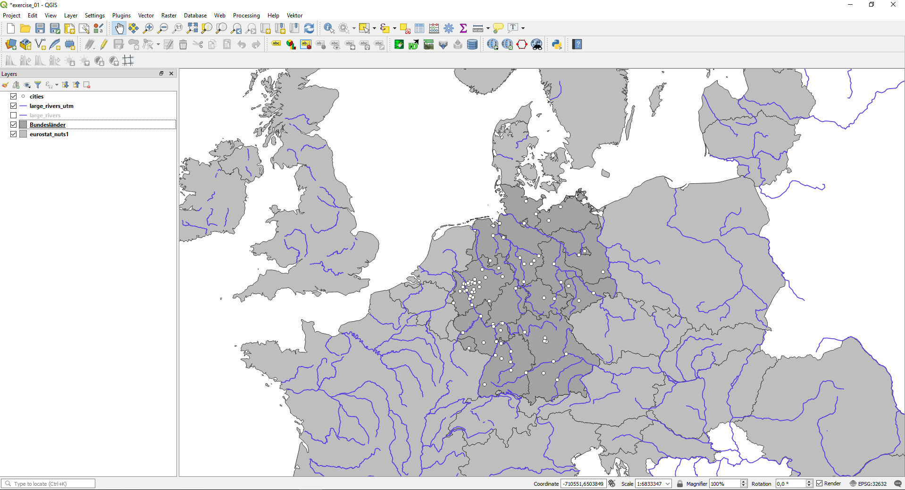

# Übung 1
## Ziel der Übung
* Die ersten Schritte wagen.
* Die Benutzeroberfläche verstehen und das Layer-Konzept kennenlernen.
* Vektor-Daten in einem GIS anzeigen und die Attributdaten einsehen.
* Vektor-Daten umprojizieren (d.h. die Projektion der Daten ändern).

## Wiki:
* Interface ([QGIS](https://courses.gistools.geog.uni-heidelberg.de/giscience/gis-einfuehrung/wikis/qgis-Interface), [ArcGIS](https://courses.gistools.geog.uni-heidelberg.de/giscience/gis-einfuehrung/wikis/arcgis-Interface))
* Layer-Konzept ([QGIS](https://courses.gistools.geog.uni-heidelberg.de/giscience/gis-einfuehrung/wikis/qgis-Layer-Konzept), [ArcGIS](https://courses.gistools.geog.uni-heidelberg.de/giscience/gis-einfuehrung/wikis/arcgis-Layer-Konzept))
* Attributdaten ([QGIS](https://courses.gistools.geog.uni-heidelberg.de/giscience/gis-einfuehrung/wikis/qgis-Attributdaten), [ArcGIS](https://courses.gistools.geog.uni-heidelberg.de/giscience/gis-einfuehrung/wikis/arcgis-Attributdaten))
* Projektionen ([QGIS](https://courses.gistools.geog.uni-heidelberg.de/giscience/gis-einfuehrung/wikis/qgis-Projektionen), [ArcGIS](https://courses.gistools.geog.uni-heidelberg.de/giscience/gis-einfuehrung/wikis/arcgis-Projektionen))

## Daten
Ladet euch [die Daten herunter](exercise_01_data.zip) und speichert sie auf eurem PC. Legt einen lokalen Ordner (nicht auf einem Netzlaufwerk wie zum Beispiel "Q://Abgabe") an und speichert dort die obigen Daten. (.zip Ordner müssen vorher entpackt werden.)

* Flussnetzwerk (Line) (Quelle: [European Environment Agency](https://data.europa.eu/euodp/en/data/dataset/data_wise-large-rivers-and-large-lakes))
* Städte (Point) (Quelle: [OpenStreetMap](https://www.openstreetmap.org))
* Bundesländer (Polygon) (Quelle: [Bundesamt für Kartographie und Geodäsie](http://www.geodatenzentrum.de/geodaten/gdz_rahmen.gdz_div?gdz_spr=deu&gdz_akt_zeile=5&gdz_anz_zeile=1&gdz_unt_zeile=81&gdz_user_id=0))
* NUTS1 Regionen (Polygon) (Quelle: [Eurostat](https://ec.europa.eu/eurostat/de/web/gisco/geodata/reference-data/administrative-units-statistical-units/nuts))

## Aufgaben

1. Öffnet QGIS/ArcGIS und macht euch mit der Benutzeroberfläche vertraut.
2. Öffnet die oben angegebenen Dateien im GIS. Ladet dazu die Vektor-Layer in euer Programm.
3. Interagiert mit der Karte und erkundet die Datensätze. Verwendet hierfür das Zoom-Werkzeug und verschiebt die Karte. Beachtet dabei die Statusleiste am unteren Bildschirmrand und wie diese sich verändert. Wie lauten die ungefähren Koordinaten für die Stadt Berlin?
4.	Macht eucht mit dem Layer-Fenster (*Layer List*) vertraut. Blendet abwechselnd verschiedene Layer ein und aus und verschiebt die Layer in der Hierarchie. Benennt den 2500_NUTS2-Layer sinnvoll um. Beachtet, dass letzteres keine Auswirkung auf die Datenquellen (Dateinamen, Speicherort) hat.
5.	Seht die Attributdaten der Layer ein. Schaut euch zu diesem Zweck die Attributtabelle an und macht euch mit der zugehörigen Nutzeroberfläche vertraut. Wie viele Features gibt es im NUTS1-Layer? Wie viele Einwohner hat Berlin?
6. Ändert die Projektion in der Kartenansicht zu WGS84 UTM32N (EPSG-Code: 32632). **Beachtet, dass dies nichts an der Projektion (den Koordinaten) der Dateien ändert, sondern lediglich die Projektion der Kartenansicht beeinflusst.** Überprüft dies in den Eigenschaften des Punkt-Layers. Welche Projektion ist dort angegeben?
7. Speichert nun das Flussnetzwerk-Layer in der Projektion WGS84 UTM 32N. **Dies ändert die Projektion der Datei.** Überprüft dies in den Eigenschaften des neu erstellten Layers.
8. Speichert euer Projekt ab.

## So (oder ähnlich) sieht's am Ende aus
### QGIS

