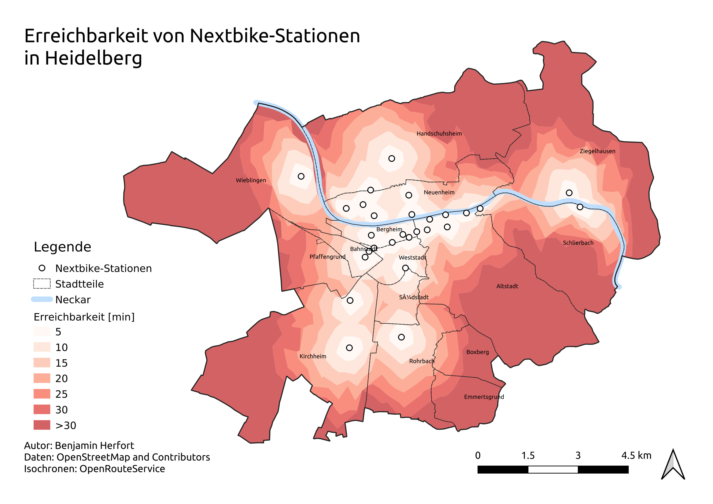

# Übung 2
## Ziel der Übung
* Eigene Vektorsignaturen gestalten.
* Eine Karte gestalten und typische Elemente wie Legenden, Nordpfeile und Maßstabsleisten hinzufügen.
* Eine Karte als PDF-Dokument exportieren.

## Wiki:
* Vektorsignaturen ([QGIS](https://courses.gistools.geog.uni-heidelberg.de/giscience/gis-einfuehrung/wikis/qgis-Vektorsignaturen), [ArcGIS](https://courses.gistools.geog.uni-heidelberg.de/giscience/gis-einfuehrung/wikis/arcgis-Vektorsignaturen))
* Kartengestaltung ([QGIS](https://courses.gistools.geog.uni-heidelberg.de/giscience/gis-einfuehrung/wikis/qgis-Kartengestaltung), [ArcGIS](https://courses.gistools.geog.uni-heidelberg.de/giscience/gis-einfuehrung/wikis/arcgis-Kartengestaltung))

## Daten
Ladet euch [die Daten herunter](exercise_02_data.zip) und speichert sie auf eurem PC.

* Punkt-Layer: Next-Bike Ausleihpunkte (Quelle: [OpenStreetMap and Contributors](https://www.openstreetmap.org/#map=6/51.330/10.453))
* Linien: Neckar (Quelle: [OpenStreetMap and Contributors](https://www.openstreetmap.org/#map=6/51.330/10.453))
* Polygon-Layer (Quelle: [OpenStreetMap and Contributors](https://www.openstreetmap.org/#map=6/51.330/10.453)):
  * Einzugsgebiete der Next-Bike Stationen (gibt an wie lange man zu Fuß zur nächsten Station benötigt)
  * Grenze Heidelbergs
  * Stadtteilgrenzen

## Aufgaben
1. Öffnet die oben angegebenen Dateien im GIS.
2. Wählt für das Punkt-Layer, sowie Linien-Layer passende Signaturen.
3. Nutzt für die Darstellung der Einzugsgebiete eine abgestufte Farbskala.
4. Beschriftet die Stadtteile mit ihrem Namen.
5. Ändert das Koordinatenbezugssystem (Projektion) eurer Ansicht auf ein für Deutschland passenderes.
6. Erstellt eine neue Druckzusammenstellung. Nutzt das Format A4 (Querformat) für eure Karte.
7. Stellt einen passenden Maßstab ein (z.B. 1:75000).
8. Verseht eure Karte mit Nordpfeil und Maßstab (Maßstabsbalken und Numerischen Maßstab).
9. Fügt abschließend Legende, Kartentitel, Autor und Datenquelle hinzu.
10. Speichert eure Karte als PDF.

## So (oder ähnlich) sieht's am Ende aus

