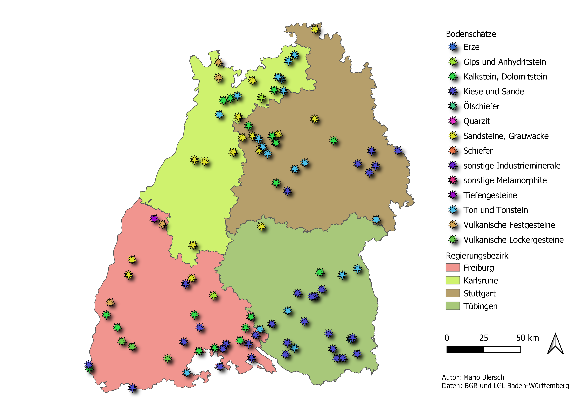

# Übung 2
## Ziel der Übung
* Eigene Vektorsignaturen gestalten.
* Eine Karte gestalten und typische Elemente wie Legenden, Nordpfeile und Maßstabsleisten hinzufügen.
* Eine Karte als PDF-Dokument exportieren.

## Wiki:
* [Vektorsignaturen](https://courses.gistools.geog.uni-heidelberg.de/giscience/gis-einfuehrung/wikis/qgis-Vektorsignaturen)
* [Kartengestaltung](https://courses.gistools.geog.uni-heidelberg.de/giscience/gis-einfuehrung/wikis/qgis-Kartengestaltung)

## Daten
Ladet euch [die Daten herunter](exercise_02_data.zip) und speichert sie auf eurem PC.

* Punkt-Layer: Bodenschaetze Punkte  (Quelle: [Bundesanstalt für Geowissenschaften und Rohstoffe (BGR)](https://services.bgr.de/atomfeeds/dataset_e2ea5cd4-87f4-4751-980a-3451fe2f5758.xml))
* Polygon-Layer (Quelle: [Landesamt für Geoinformation und Landentwicklung](https://www.lgl-bw.de/Produkte/Open-Data/)):

## Aufgaben
1. Öffne die oben angegebenen Dateien in QGIS.
2. Wähle für das Punkt-Layer eine passende Signaturen.
3. Ändere das Koordinatenbezugssystem (Projektion) eurer Ansicht auf ein für Deutschland passenderes.
6. Erstelle eine neue Druckzusammenstellung. Nutzt das Format A4 (Querformat) für eure Karte.
7. Stelle einen passenden Maßstab ein (z.B. 1:12000000).
8. Versehe deine Karte mit Nordpfeil und Maßstab (Maßstabsbalken und Numerischen Maßstab).
9. Füge abschließend Legende, Autor und Datenquelle(n) hinzu.
10. Speicher deine Karte als PDF.

## So (oder ähnlich) sieht's am Ende aus

