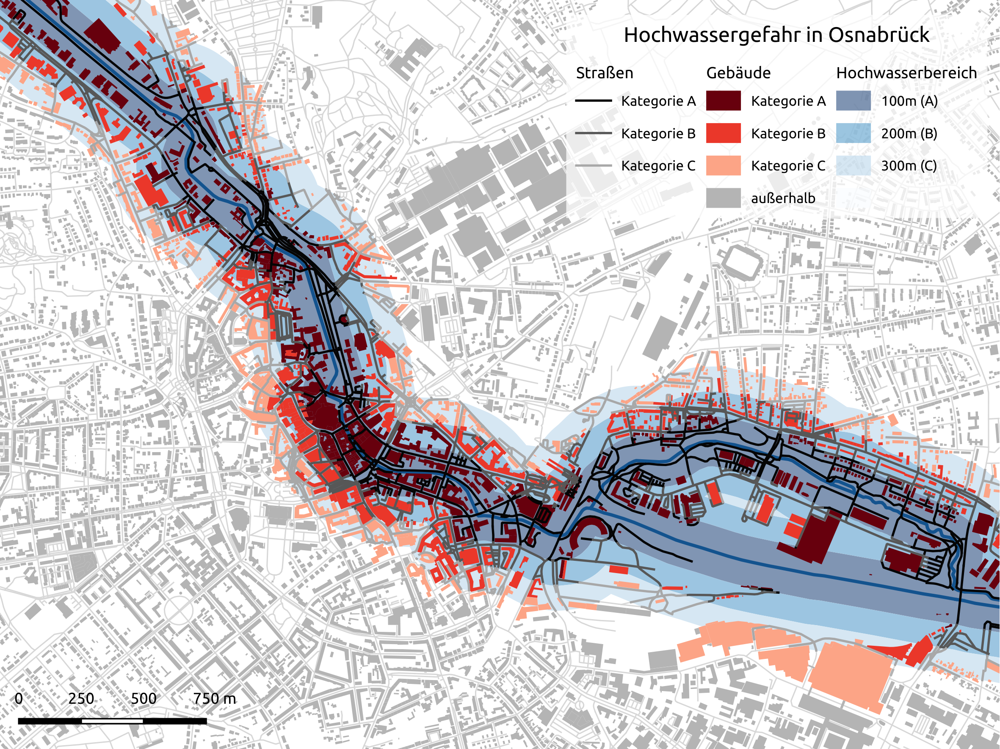
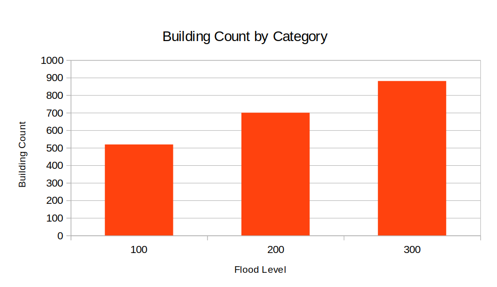
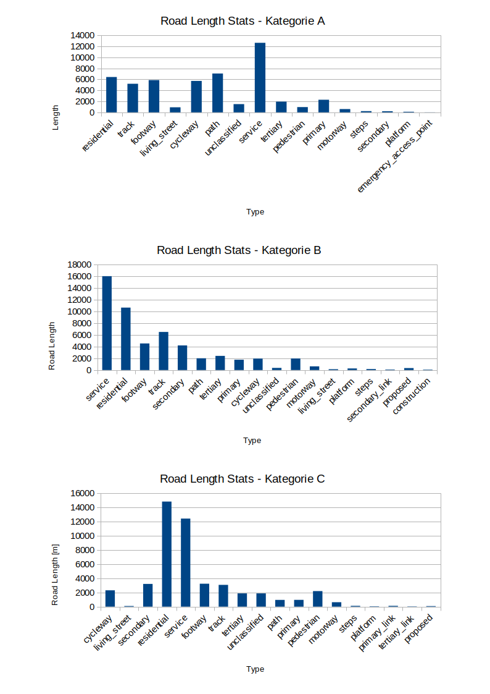

# Übung 4
## Ziel der Übung
* Geometriefunktionen vertiefen.
* Vektordaten räumlich Verschneiden.
* Räumliche Joins durchführen.
* Tabellenfunktionen nutzen und einfache Statistiken erstellen.

## Wiki:
* [Geometrieoperationen](https://courses.gistools.geog.uni-heidelberg.de/giscience/gis-einfuehrung/wikis/qgis-Geometrieoperationen)
* [Räumliche Verschneidungen](https://courses.gistools.geog.uni-heidelberg.de/giscience/gis-einfuehrung/wikis/qgis-Räumliche-Verschneidungen)
* [Räumliche Joins](https://courses.gistools.geog.uni-heidelberg.de/giscience/gis-einfuehrung/wikis/qgis-Räumliche-Joins)
* [Tabellenfunktionen](https://courses.gistools.geog.uni-heidelberg.de/giscience/gis-einfuehrung/wikis/qgis-Tabellenfunktionen)

## Daten
Ladet euch [die Daten herunter](exercise_04_data.zip) und speichert sie auf eurem PC. Legt einen lokalen Ordner an und speichert dort die obigen Daten. (.zip Ordner müssen vorher entpackt werden.)

* Osnabrück Fluss Hase (Line) (Quelle: [OpenStreetMap](https://www.openstreetmap.org))
* Osnabrück Straßennetzwerk (Line) (Quelle: [OpenStreetMap](https://www.openstreetmap.org))
* Osnabrück Stadtgrenze (Polygon) (Quelle: [OpenStreetMap](https://www.openstreetmap.org))
* Osnabrück Gebäude (Polygon) (Quelle: [OpenStreetMap](https://www.openstreetmap.org))

## Aufgaben

### Datenvorbereitung
1. Schneidet den Gebäude-Datensatz und den Straßen-Layer auf das Stadtgebiet Osnabrücks zu (Clip).
2. Projiziert anschließend alle Daten in ein metrisches Koordinatensystem.

### Hochwasserbereich ermitteln
3. Verbindet alle Teilstücke der Hase zu einer einzelnen Geometrie. Nutzt dazu die Dissolve-Funktion.
4. Zur Berechnung der Hochwassergefahr nutzen wir einen vereinfachten Ansatz. Berechnet 3 Stufen der Hochwassergefahr mithilfe der (Multiple)Buffer-Funktion:
  (a) alle Bereiche in Abstand von maximal 100 m zur Hase,
  (b) alle Bereiche zwischen 100 m und 200 m Abstand,
  (c) alle Bereiche mit einem Abstand von mehr als 200 m bis zu 300 m.
* optional: Färbt die Bereiche ensprechend der Hochwassergefahr ein.

### Gebäude nach Hochwassergefahr einteilen
5. Fügt zu jedem Gebäude die maximale Hochwassergefahrenklasse (a, b, c) hinzu. Nutzt dafür die Spatial-Join Funktion.
6. Zählt wie viele Gebäude in jede der drei Klassen vorhanden sind. Erstellt dazu eine kategorisierte Statistik der Attributwerte in Form einer Tabelle und speichert diese.
* optional: Färbt die Gebäude ensprechend der Hochwassergefahr ein.
* optional: Visualisiert die Statistik mit einem Balkendiagramm. Nutzt dafür ein Programm eurer Wahl (z.B. Excel).

### Hochwassergefährdete Bereiche im Straßennetzwerk ausweisen
7. Verschneidet das Straßennetzwerk mit dem Hochwassergefahr-Layer.
8. Berechnet anschließend die Länge der neu enstandenen Straßensegmente.
9. Auf welcher Gesamtlänge sind die unterschiedlichen Straßentypen möglicherweise von Hochwasser pro Klasse (a, b, c) betroffen? Erstellt dafür eine gruppierte Statistik.
* optional: Visualisiert die Statistik in einem Balkendiagramm. Nutzt dafür ein Programm eurer Wahl (z.B. Excel).

## So (oder ähnlich) sieht's am Ende aus

