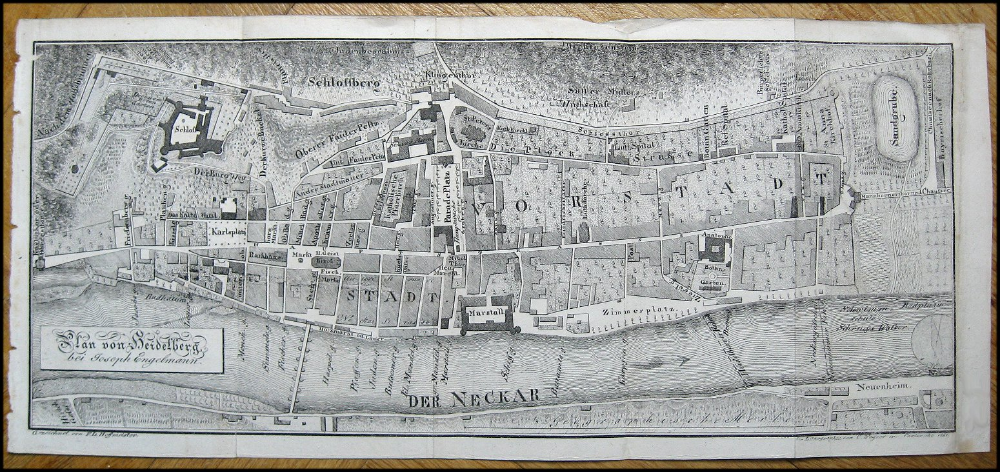

# Übung 5
## Ziel der Übung
* web-basierte Hintergrundkarten nutzen
* Vektordaten händisch erstellen (Digitalisieren)
* Ein Bild Georeferenzieren

## Wiki:
* Basemaps ([QGIS](https://courses.gistools.geog.uni-heidelberg.de/giscience/gis-einfuehrung/wikis/qgis-Basemaps), [ArcGIS](https://courses.gistools.geog.uni-heidelberg.de/giscience/gis-einfuehrung/wikis/arcgis-Basemaps))
* Digitalisieren ([QGIS](https://courses.gistools.geog.uni-heidelberg.de/giscience/gis-einfuehrung/wikis/qgis-Digitalisierung), [ArcGIS](https://courses.gistools.geog.uni-heidelberg.de/giscience/gis-einfuehrung/wikis/arcgis-Digitalisierung))
* Georeferenzieren ([QGIS](https://courses.gistools.geog.uni-heidelberg.de/giscience/gis-einfuehrung/wikis/qgis-Georeferenzierung), [ArcGIS](https://courses.gistools.geog.uni-heidelberg.de/giscience/gis-einfuehrung/wikis/arcgis-Georeferenzierung))

## Daten
Ladet euch [die Daten herunter](exercise_05_data.zip) und speichert sie auf eurem PC. Legt einen lokalen Ordner (nicht auf einem Netzlaufwerk wie zum Beispiel "Q://Abgabe") an und speichert dort die obigen Daten. (.zip Ordner müssen vorher entpackt werden.)

## Aufgaben
### Häuser und Straßen kartieren

1. Erstellt zwei neue Layer für (a) Häuser und (b) Straßen in Heidelberg.
2. Fügt zu jedem Layer ein Attribute "Name" hinzu.
3. Nutzt als Kartierungsgrundlage eine Hintergrundkarte auf Basis von Satellitendaten (z.B. Bing)
4. Erstellt mindestens 3 Gebäude und 3 Straßen im Heidelberger Stadtgebiet. Erstellt mindestens 1 Gebäude mit einem Innenhof (z.B. Mathematikon).
5. Fügt zu jedem Feature den passenden Namen hinzu.

### Ein Bild georeferenzieren
#### Kontext
Das Kurpfälzische Museum möchte historische Daten aus Heidelberg mit einer Hintergrundkarte versehen. Hierfür benötigt das Museum eine geeignete georeferenzierte Karte. Ihr sollt die folgende historische Karte von 1821 georeferenzieren:

1. Verseht das zur Verfügung gestellte Raster mit WGS84 Pseudo-Mercator-Koordinaten (EPSG: 3857).
2. Verwendet als Referenz-Layer Webkarten eurer Wahl, welche ihr in Form einer Hintergrundkarte einbinden könnt.
3. Wählt eine geeignete Transformationsvorschrift und setzt genügend und ausreichend verteilte Passpunkte.
4. Kontrolliert abschließend euren Erfolg, indem ihr die Passgenauigkeit des georeferenzierten Bildes mit überlagerten Hintergrundkarte vergleicht.
