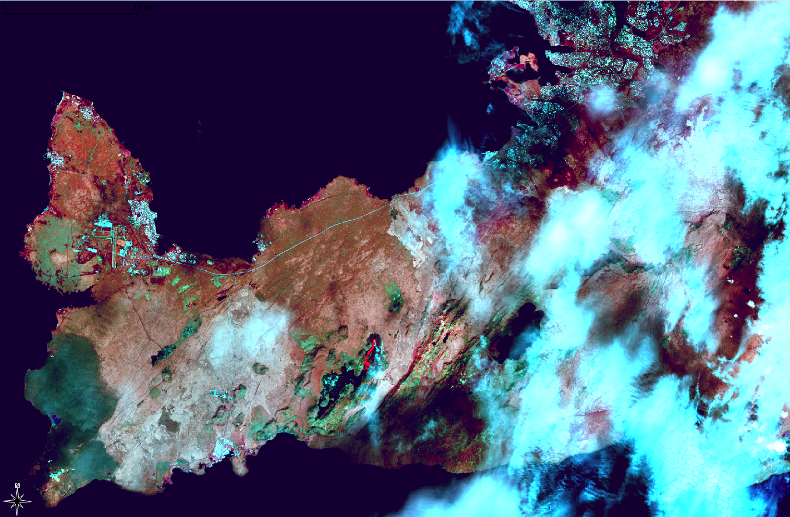

# Übung 5a
## Ziel der Übung
* Web-basierte Hintergrundkarten nutzen
* Vektordaten händisch erstellen (Digitalisieren)

## Wiki:
* [Basemaps](https://courses.gistools.geog.uni-heidelberg.de/giscience/gis-einfuehrung/wikis/qgis-Basemaps)
* [Digitalisieren](https://courses.gistools.geog.uni-heidelberg.de/giscience/gis-einfuehrung/wikis/qgis-Digitalisierung)

## Daten
Ladet euch [die Daten herunter](exercise_5a_data_iceland.zip) und speichert sie auf eurem PC. Legt einen lokalen Ordner an und speichert dort die obigen Daten. (.zip Ordner müssen vorher entpackt werden.)
* Landsat 9 Daten (Quelle: Landsat-9 image from 17.07.2023 of the U.S. Geological Survey via [USGS EarthExplorer](https://earthexplorer.usgs.gov/))

## Aufgabe
*In den Daten findet ihr eine Landsat 9 Satellitenbildaufnahme, die am 17.07.2023 aufgenommen wurde. Wir wollen herausfinden, wie groß die von Lava überflossene Fläche ist.*

1. Erstellt zwei neue Layer: Einen für (a) die Lavafläche und einen zweiten (b) für die Straßen.
2. Fügt zu jedem Layer ein Attribute "Name" hinzu.
3. Nutzt als Kartierungsgrundlage die Landsat 9 Aufnahme in den Daten und eine Hintergrundkarte auf Basis von Satellitendaten (z.B. Bing, OSM). Diese könnt ihr mit Hilfe des Plugins *QuickMapServices* in QGIS einbinden.
4. Digitalisiere die Fläche des Eruptionsereignissen ab. Digitalisiere ebenfalls die Straße von Reykjavik nach Grindavik inkl. deren Kennzeichnung ab.
5. Füge zu jedem Feature den passenden Namen hinzu.
6. Optional: Füge zur von dir bestimmten Lavafläche einen Hyperlink zu weiteren Informationen (bspw. siehe unten) hinzu.

* Für weitere Informationen könnt ihr hier reinschauen: [NASA Earth Observation](https://earthobservatory.nasa.gov/images/151653/lava-and-smoke-blanket-fagradalsfjall)
* Einige vor Ort Aufnahmen könnt ihr euch hier anschauen: [Volcano at Litlihrutur Iceland](https://www.youtube.com/watch?time_continue=269&v=tvxbKWxmfXk&embeds_referring_euri=https%3A%2F%2Fwww.bing.com%2F&embeds_referring_origin=https%3A%2F%2Fwww.bing.com&source_ve_path=MTM5MTE3LDEzOTExNywyMzg1MQ&feature=emb_title)

     Quelle: <a> Own research, Landsat-9 image from 17.07.2023 of the U.S. Geological Survey </a>

