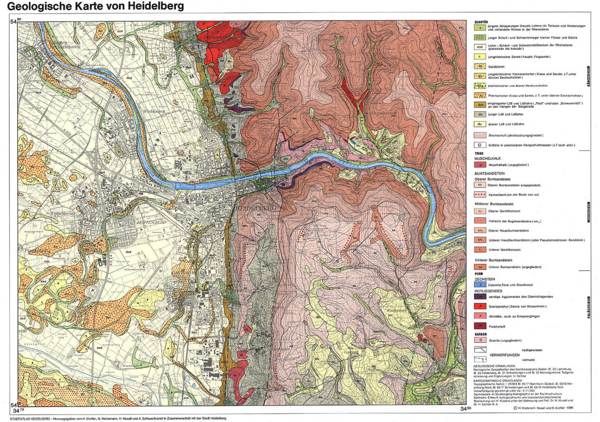

# Übung 5b
## Ziel der Übung
* web-basierte Hintergrundkarten nutzen
* Ein Bild Georeferenzieren

## Wiki:
* [Basemaps](https://courses.gistools.geog.uni-heidelberg.de/giscience/gis-einfuehrung/wikis/qgis-Basemaps)
* [Georeferenzieren](https://courses.gistools.geog.uni-heidelberg.de/giscience/gis-einfuehrung/wikis/qgis-Georeferenzierung)

## Daten
Ladet euch [die Daten herunter](exercise_05b_data.zip) und speichert sie auf eurem PC. Legt einen lokalen Ordner an und speichert dort die obigen Daten. (.zip Ordner müssen vorher entpackt werden.)

### Ein Bild georeferenzieren
#### Kontext
Du brauchst für dein Projekt eine geologische Karte von Heidelberg. Die einzig verfügbaren Informationen, die du finden kannst ist eine PDF Karte der Universität Heidelberg. Um diese geologische Karte mit deinen weiteren Geodaten zu verknüpfen, müssen wir diese georeferenzieren.

     Quelle: <a href = "http://archiv.ub.uni-heidelberg.de/volltextserver/1662/2/Karte2.pdf"> UB Heidelberg </a>

1. Versehe das zur Verfügung gestellte Raster mit WGS84 Pseudo-Mercator-Koordinaten (EPSG: 3857).
2. Verwende als Referenz-Layer eine Webkarten deiner Wahl, welche du in Form einer Hintergrundkarte einbinden kannst.
3. Wähle eine geeignete Transformationsvorschrift und setzt genügend und ausreichend verteilte Passpunkte.
4. Kontrolliere abschließend deinen Erfolg, indem du die Passgenauigkeit des georeferenzierten Bildes mit überlagerten Hintergrundkarte vergleichst.
