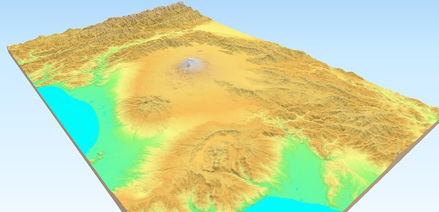

# Übung 6
## Ziel der Übung
* Rasterdaten im GIS öffnen und kennenlernen
* farbliche Darstellung der Rasterwerte anpassen
* Rasterdaten in Vektordaten umwandeln
* Globale Rasteroperationen anwenden (z.B. Projektion ändern)
* Lokale Rasteroperationen anwenden (z.B. NDVI berechnen)

## Wiki:
* [Rasterdaten im GIS öffnen und kennenlernen](https://courses.gistools.geog.uni-heidelberg.de/giscience/gis-einfuehrung/wikis/qgis-Layer-Konzept)
* [Darstellung von Rasterdaten](https://courses.gistools.geog.uni-heidelberg.de/giscience/gis-einfuehrung/wikis/qgis-Rasterdarstellung)
* [Vektordaten in Rasterdaten umwandeln](https://courses.gistools.geog.uni-heidelberg.de/giscience/gis-einfuehrung/wikis/qgis-Konvertierung)
* [Globale Rasteroperationen](https://courses.gistools.geog.uni-heidelberg.de/giscience/gis-einfuehrung/wikis/qgis-Globale-Funktionen)
* [Lokale Rasteroperationen](https://courses.gistools.geog.uni-heidelberg.de/giscience/gis-einfuehrung/wikis/qgis-Lokale-Funktionen)

## Daten
Ladet euch vom USB-Stick und speichert sie auf eurem PC. Legt einen lokalen Ordner an und speichert dort die Daten. (.zip Ordner müssen vorher entpackt werden.)

* Landsat 8 data (Source: Landsat-8 image courtesy of the U.S. Geological Survey; Downloaded via [EarthExplorer](https://earthexplorer.usgs.gov/)
* ASTER Global Digital Elevation Map (GDEM) SRTM DEM (Source: [NASA JPL](https://asterweb.jpl.nasa.gov/GDEM.asp)

## Aufgaben

### Aufgabe 1: Arbeiten mit Geländemodellen
* Verbindet die ASTER-Kacheln miteinander (z.B. mit *merge*).
* Bringt das ASTER-Höhenmodell in eine metrische Projektion (z.B. WGS84/UTM 33N).
* Verschafft euch einen Überblick über die Höhenwerte. Was sind die maximalen und minimalen Höhen im Untersuchungsgebiet. Schaut dies in den Layer-Eigenschaften nach. 
* Berechnet aus dem ASTER-Höhenmodell Konturlinien 100 Meter Schritten. Vergleicht es mit 1 Meter Schritten.
* Berechnet ein Hillshade.

### Aufgabe 2: Arbeiten mit Landsat 8 Daten
* In dieser Aufgabe arbeiten wir mit Daten des Landsat 8 Satelliten. Wir nutzen für unsere Analyse die Bänder 2, 3, 4 & 5. Welchen Farben entsprechen diese Bänder?
* Erstellt ein Raster Komposit (bzw. Virtual Raster) aus den gegebenen Bändern.
* Visualisiert das Komposit in Falschfarben, sodass Vegetation rot erscheint.
* Berechnet den Normalized Difference Vegetation Index.
* Erstellt anschließend NDVI-Klassen. Orientiert euch dabei an folgender Einteilung.
* Stellt die Klassen farblich sinnvoll dar.

| Kategorie | NDVI |
| --- | --- |
|Wasser und Schnee| < 0 |
| Felsen, Sand, Gebäude | 0 - 0.2 |
| Gras, Sträucher | 0.2 - 0.4 |
| Wald und intensive Landwirtschaft | >0.4 |

### Aufgabe 3: 3D Visualisierung erstellen
* Erstellt ein Polygon (Vektordatei), mit dem ihr die Landsat-8 Daten und das ASTER-Höhenmodell verkleinern (clippen) könnt. Ziel ist es ein Untersuchungsgebiet um den Vesuv zu definieren.
* Installiert das Plugin *Qgis2threejs*.
** Startet den *Qgis2threejs Explorer*, aktiviert das ASTER Höhenmodell & das Landsat-8 Bild. Tipp: Ändere die Überhöhung (exaggeration) in den Scene Settings zu 2.5.
* Schaut euch das Modell an, findet eine gute Perspektive und exportiert diese als .png 

## So (oder ähnlich) kann es am Ende aussehen

Quelle: [Qthreejs Plugin](https://qgis2threejs.readthedocs.io/en/docs/_images/top.jpg) 
