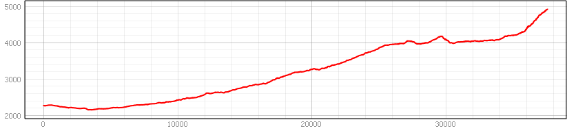

# Übung 7
## Ziel der Übung.
* Rasterdaten zuschneiden  
* Reliefanalysen durchführen
* zonale Statistiken berechnen
* Rasterdaten in Vektordaten umwandeln
* ein Höhenprofil erstellen

## Wiki:
* [Rasterdaten in Vektordaten umwandeln](https://courses.gistools.geog.uni-heidelberg.de/giscience/gis-einfuehrung/wikis/qgis-Konvertierung)
* [fokale Rasteroperationen](https://courses.gistools.geog.uni-heidelberg.de/giscience/gis-einfuehrung/wikis/qgis-Fokale-Funktionen)
* [zonale Rasteroperationen](https://courses.gistools.geog.uni-heidelberg.de/giscience/gis-einfuehrung/wikis/qgis-Zonale-Funktionen)
* [weitere Rasteroperationen](https://courses.gistools.geog.uni-heidelberg.de/giscience/gis-einfuehrung/wikis/qgis-Weitere-Rasterfunktionen)

## Daten
Ladet euch [die Daten herunter](exercise_07_data.zip) und speichert sie auf eurem PC. Legt einen lokalen Ordner an und speichert dort die obigen Daten. (.zip Ordner müssen vorher entpackt werden.)
* Polygon-Layer: national_parks (Quelle: OpenStreetMap and Contributors)
* Linien-Layer: trails (Quelle: OpenRouteService, OpenStreetMap and Contributors)
* Raster-Layer: ASTER Höhendaten (Quelle: METI/NASA)

## Aufgaben
### Aufgabe 1: Vorbereitung
* Bringt die Höhendaten in eine passende metrische Projektion (z.B. UTM37N).
* Schneidet den Raster-Datensatz auf die Ausdehnung des Nationalpark-Layers zu.

### Aufgabe 2: Reliefanalysen
* Berechnet zunächst einen Hillshade für das Geländemodell.
* Ermittelt die Steigung in °.
* Erstellt Übersichtsstatistiken für die beiden Nationalparks.
  * Was ist die maximale Steigung pro Nationalpark?
  * Wie hoch ist die durchschnittliche Steigung pro Nationalpark?
* Glättet euer Ergebnis in dem ihr pro Pixel den Durchschnitt der 11x11 Nachbarschaft berechnet.
* Selektiert besonders steile Regionen (>30°) (nutzt dazu zunächst den Raster Calculator oder das Reclassify Tool)
* Konvertiert die Auswahl ins Vektorformat.

### Aufgabe 3: Höhenprofil
* erstellt für die Sirimon-Route im trails-Layer ein Höhenprofil.
* Das Höhenprofil soll auf der x-Achse die Distanz in Meter zeigen, auf der y-Achse die Höhe ü.N.

Das könnte dann ungefähr so aussehen:

