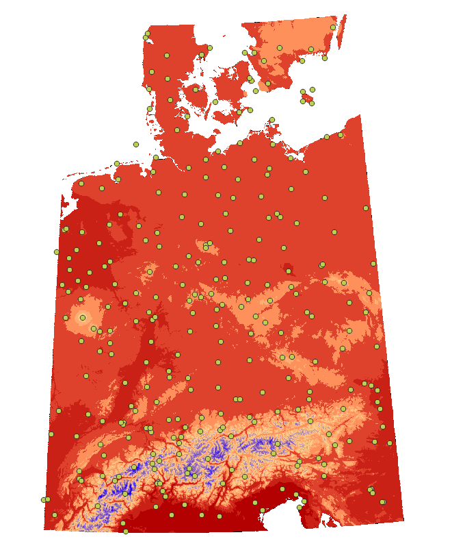

# Übung 8
## Ziel der Übung
* Räumliche Interpolation anwenden
* Rasterfunktionen vertiefen

## Wiki:
* [Räumliche Interpolationsverfahren](https://courses.gistools.geog.uni-heidelberg.de/giscience/gis-einfuehrung/wikis/qgis-Räumliche-Interpolationsverfahren) 
* [lokale Rasterfunktionen](https://courses.gistools.geog.uni-heidelberg.de/giscience/gis-einfuehrung/wikis/qgis-Konvertierung)

## Daten
Lade dir [die Daten herunter](exercise_08_data.zip) und speichert sie auf eurem PC. Lege einen lokalen Ordner an und speichere dort die obigen Daten. (.zip Ordner müssen vorher entpackt werden.)
* Höhenmodell: germany_dem.tif (Quelle: [GTOPO30 USGS](https://www.usgs.gov/centers/eros/science/usgs-eros-archive-digital-elevation-global-30-arc-second-elevation-gtopo30?qt-science_center_objects=0#qt-science_center_objects))
* Messstationen: temp_stations.shp
* Messdtationen: [DWD.csv](https://www.geo.fu-berlin.de/en/v/soga/Geodata-analysis/geostatistics/Data-sets-used/DWD-weather-data-Germany/index.html)

## Aufgaben
### Aufgabe 1: Vorbereitung
* Bringe die Daten in ein geeignetes Koordinatensystem.
* Selektiere Stationen mit einer gültigen Höhenangabe.
* Füge die durchschnittliche Jahrestemperatur als Attribut der Messstationen hinzu. Nutzt dazu einen Join.

### Aufgabe 2: Temperaturwerte anpassen und Interpolation durchführen.
* Berechne für jede Messstation eine normalisierte Jahresdurchschnittstemperatur. Diese soll die Temperatur angeben, wenn die Messstation auf 0 m üNN liegen würde. Nutzt dafür folgenden Zusammenhang:
  * Temperaturabnahme um 0,54°C je 100 Höhenmeter
* Inpterpoliere anhand der gewonnenen Werte die Durchschnittstemperaturen in Deutschland.
  * Nutze dazu Inverse Distanz Gewichtung (IDW)
  * und einen Power-Wert von 2
* Korrigiere eure gewonnenen Ergebnisse erneut unter Berücksichtigung der tatsächlichen Höhe. Nutzt dazu den Raster-Calculator und den oben genannten Zusammenhang und das Höhenmodell.
* Style das Ergebnis, sodass Temperaturunterschiede deutlich erkennbar werden.

Das könnte dann ungefähr so aussehen:

*(Wer findet den Fehler in dieser Abbildung? Welche Messstation liefert einen möglicherweise falschen Wert?)*
