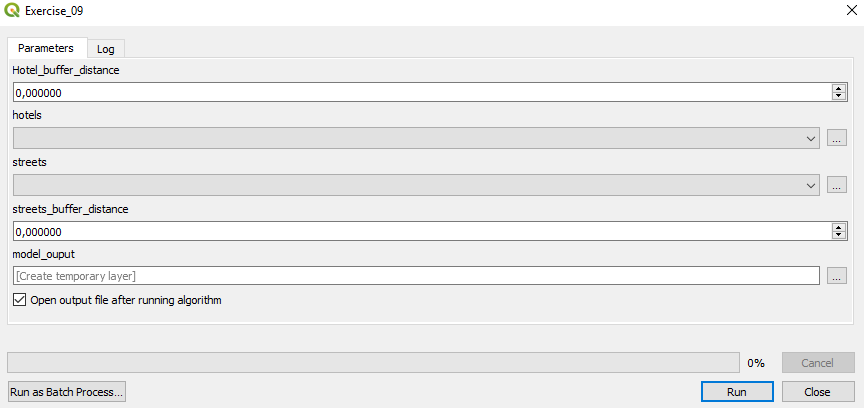

# Übung 9
## Ziel der Übung
* Workflows automatisieren

## Wiki:
* [Automatisierung](https://courses.gistools.geog.uni-heidelberg.de/giscience/gis-einfuehrung/wikis/qgis-Automatisierung)

## Daten
Ladet euch [die Daten herunter](exercise_09.zip) und speichert sie auf eurem PC. Legt einen lokalen Ordner (nicht auf einem Netzlaufwerk wie zum Beispiel "Q://Abgabe") an und speichert dort die obigen Daten. (.zip Ordner müssen vorher entpackt werden.)
* Straßen-Layer (Quelle: [OpenStreetMap and Contributors](https://www.openstreetmap.org))
* Hotels-Layer (Quelle: [OpenStreetMap and Contributors](https://www.openstreetmap.org))

## Kontext
Ihr möchtet in Zukunft wiederkehrend den vom Verkehr beeinträchtigten Bereich rund um Hotels berechnen. Dabei möchten ihr auch Parameter variieren. Erstellt hierfür ein geeignetes Werkzeug.

## Aufgabe
## Aufgabe 1: Modell erstellen
Erstellt ein Modell, welches

* einen Punkt- und einen Linienlayer einlesen kann
* die Punkte mit einem frei wählbaren Pufferabstand puffert (der von Hotels oder anderen Einrichtungen direkt erreichbare Bereich)
* Die Linien mit einem zweiten frei wählbaren Pufferabstand puffert (welcher den vom Lärm beeinflussten Bereich rund um Straßen repräsentiert)
* die Schnittmenge dieser Puffer berechnet
* abschließend noch einen *Dissolve* ausführt

## Aufgabe 2: Modell ausführen
* nutzt euer Modell um die folgende Parameterkombinationen zu testen
  * Hotel-Buffer: 50m, Straßen-Buffer: 50m
  * Hotel-Buffer: 100m, Straßen-Buffer: 100m
  * Hotel-Buffer: 150m, Straßen-Buffer: 150m

So oder ähnlich könnte euer finales Modell aussehen:

